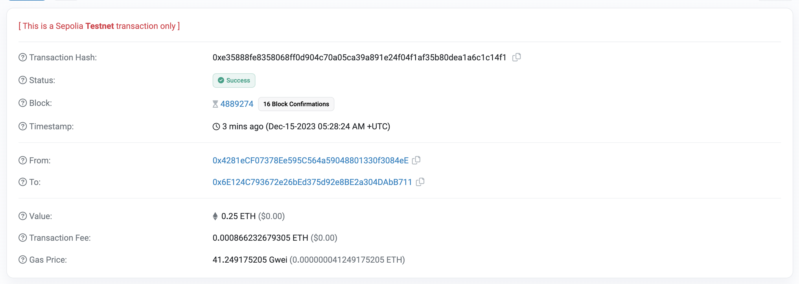

# meta mask

1. public key which is differnt for differnt account 
2. private key is alsi diffrent for diffrent accout its is use to make transections we should keep it private
3. secreate alphabate this is main password which should not be share if it leaks we will loose acess to all account link to this meta mask

- TESTNET 
are the test network not real money this are use for testing.





- when we do a transection thire is one gass fee and one Transection fee

- GAS -is a unit of computational measure 

Teansection fees = Gas price * Gas used 

gas price is also depent on the traffic  (more trancsection 


- HASH:
A unique fixed length string, meant to identify a piece of data. They are created by placing said data into a "hash function"

-  Genesis Block:
The first block in a blockchain


- Mining:
The process of finding the "solution" to the blockchain "problem".
In our example, the "problem" was to find a hash that starts with four zeros.
Nodes get paid for mining blocks.


- Block:
A list of transactions mined together

- Decentralized:
Having no single point of authority

- Nonce:
A "number used once" to find the "solution" to the blockchain problem.
It's also used to define the transaction number for an account/address.


- The most important thing, is that sending
transactions gets more expensive the more people use the chain

- Node:
 A single instance in a decentralized network

 - Consensus :
 is the mechanism used to agree on the state of a blockchain 

1. Chain Selection
2. Sybil Resistance


- Proof Of Work (PoW)


```js

// SPDX-License-Identifier: MIT
pragma solidity ^0.8.8;
contract SimpleStorage {
// This gets initialized to zero!
// <- This means that this section is a comment!
uint256 public favoriteNumber;
functión store(uint256 _favoriteNumber)
public {
favoriteNumber = _favoriteNumber;
}
// view, pure
function retrieve() public view returns(uint256){
return favoriteNumber;
｝
```


# EVM can access and store information in six places:

1. Stack

2. Memory

3. Storage

4. Calldata

5. Code

6. Logs

